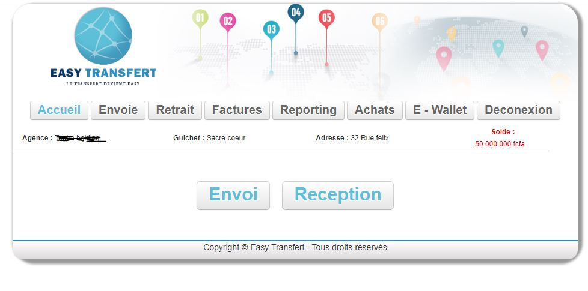
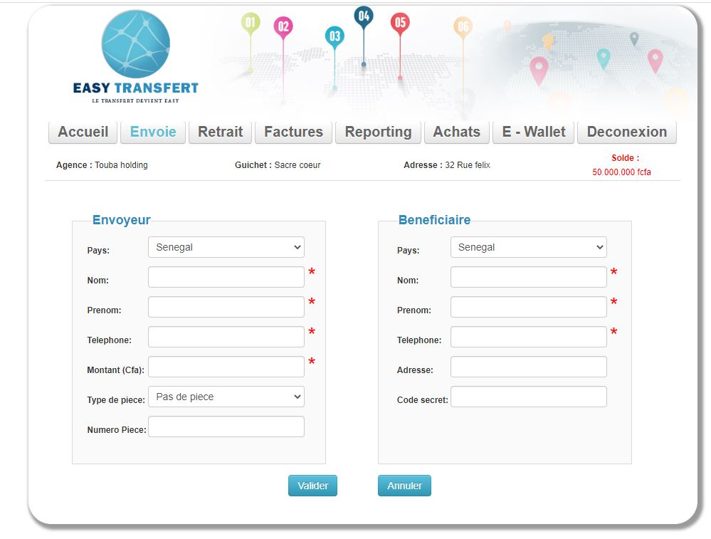
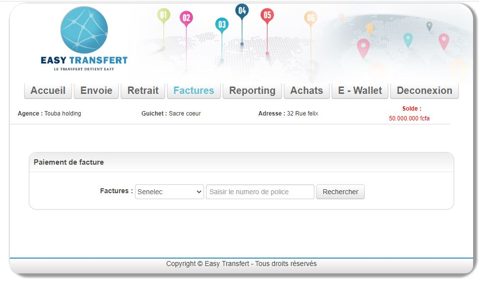
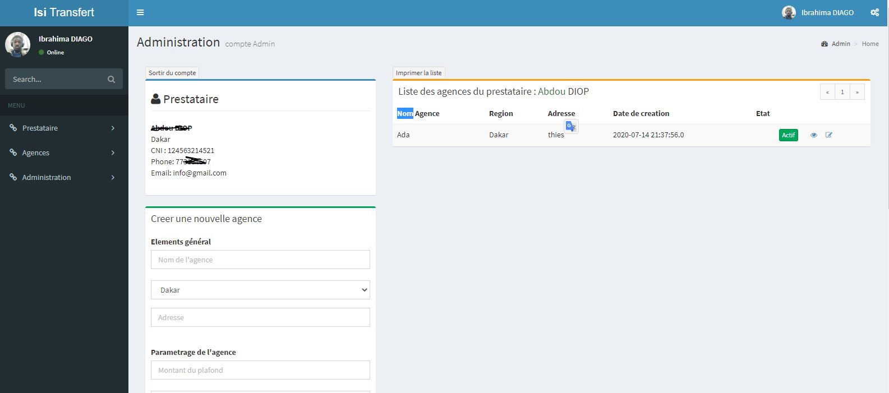

# Exemple d'application de transfert d'argent
Ce projet est juste un exercice pour réaliser une application de transfert d'argent avec springBoot, JPA, Thymeleaf et MySQL. Il peut servir de point de départ pour un vrai projet. 
- SpringBoot
- JPA
- Thymeleaf
- Mysql

# Fontionnalités de base

- Gestion Des prestataires (gerer par le partenaire)
- Gestion des agences (gerer par un superviseur)
- Gestion des guichets (Gerer par des guichetiers)
- etc.........

Un prestataire peut avoir plusieurs agences et dans chaque agence on peut avoir plusieurs guichets.
Le prestataire a un compte qui lui permet de gérer toutes les agences.

Chaque agence à un superviseur et ce dernier a un compte spécifique qui lui permet de créer des guichets 

Les guichets peuvent êtres paramétrés pour ne faire que des envois et ou des retraits.

Dans une agence On peut verser de l’argent ou faire un retrait de liquidité. Pour chaque agence on peut paramétrer le taux à l’envoi, le taux pour le retrait et le plafond. 

Redaction en cours ............

